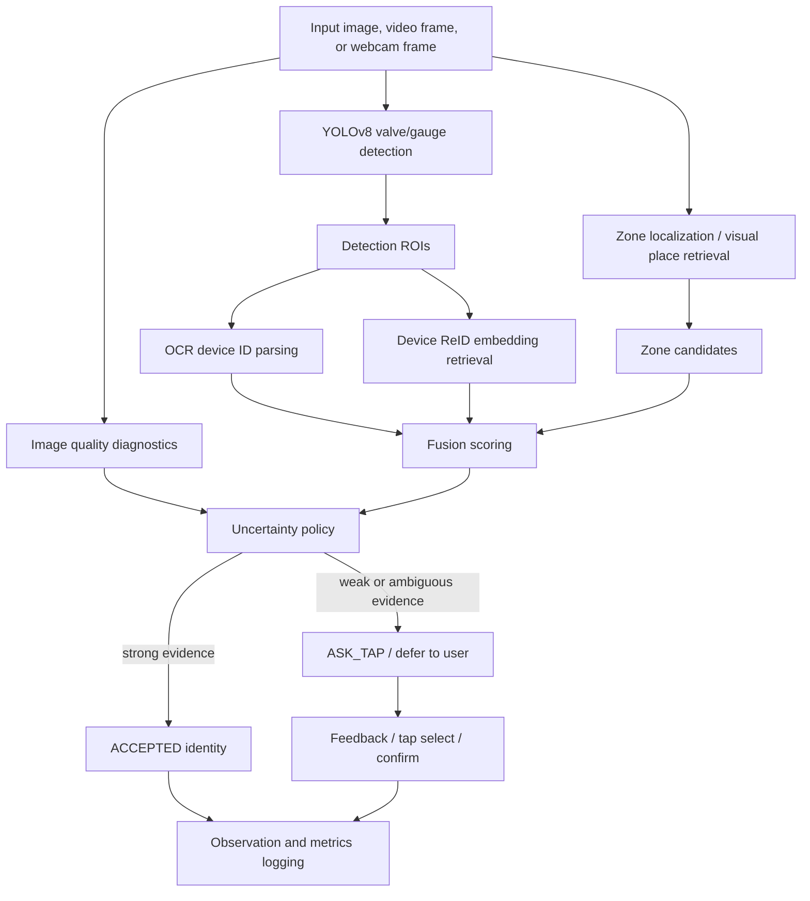
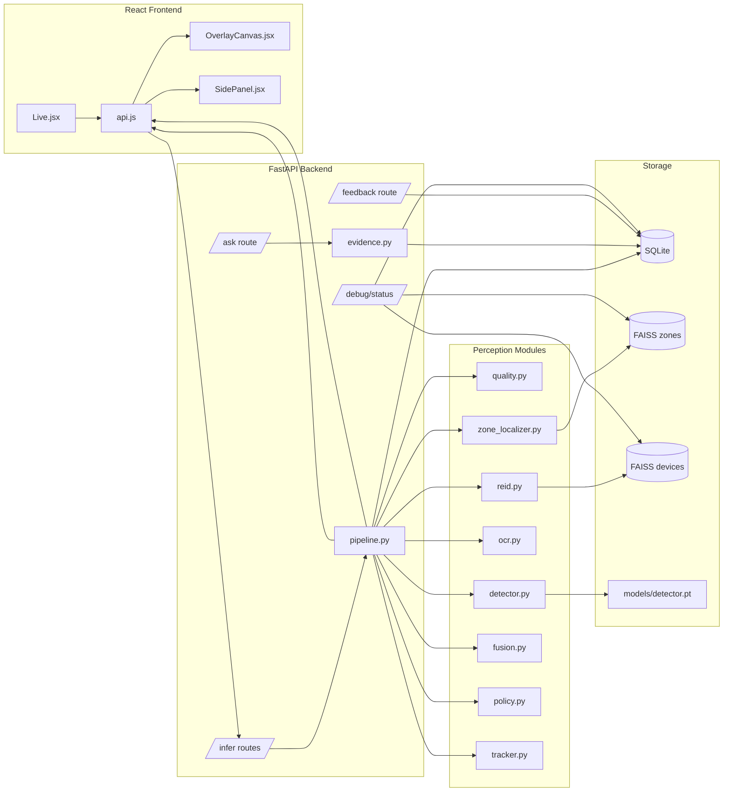
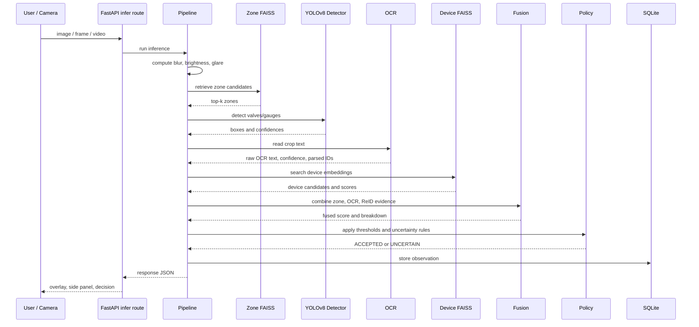
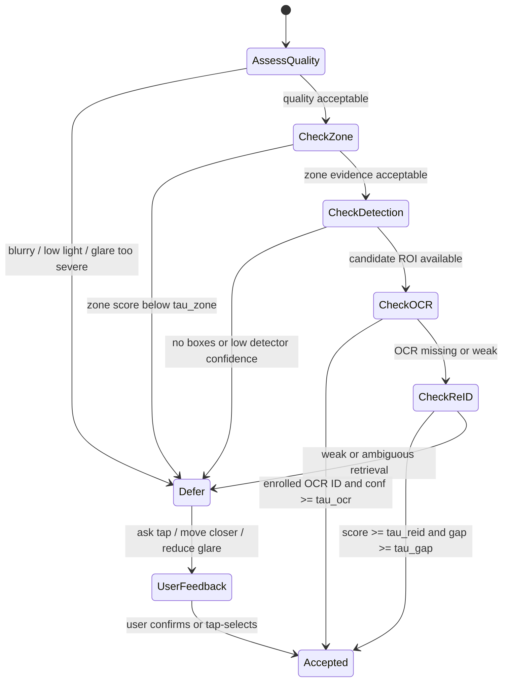
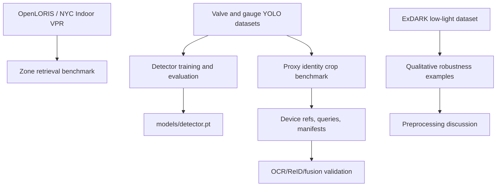
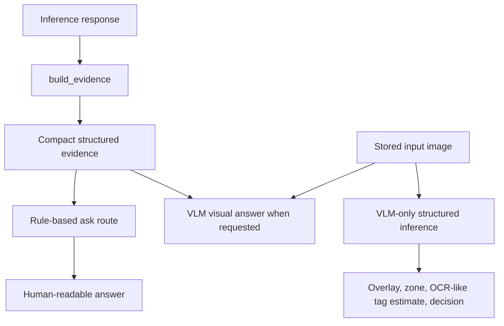

# ValveLens

ValveLens is an uncertainty-aware industrial vision assistant for finding, detecting, and identifying devices in visually repetitive facility-like environments.

The project is built around a simple research position:

> Industrial perception is not solved by asking "what object is in this image?" The operational question is usually "where am I, which exact device is this, how reliable is the evidence, and what should happen when the system is not sure?"

ValveLens therefore treats perception as a composed evidence pipeline rather than a single detector call. It combines scene context, object detection, OCR, retrieval-based identity, quality diagnostics, score fusion, and an uncertainty policy. When evidence is strong, the system can accept an identity. When evidence is weak, it defers and asks for user interaction instead of pretending to know.

Current practical stage: `v0.5.x interactive demo package with dual inference modes`.

## Current Status

The repository is no longer a `v0.1` skeleton. The current implementation includes:

- FastAPI backend with image, video, webcam, feedback, debug, devices, zones, and ask routes
- React/Vite frontend with live image/webcam/video workflows, overlays, side-panel evidence, feedback, an evidence-aware question interface, and an image-mode inference regime switch
- trained YOLOv8 valve/gauge detector at `models/detector.pt`
- OpenCLIP embeddings plus FAISS for zone retrieval and device ReID-style retrieval
- SQLite metadata store for zones, keyframes, devices, references, observations, and feedback
- OCR device-ID parsing with EasyOCR or pytesseract fallback
- tracker and session-aware identity carryover helpers
- score fusion and uncertainty policy
- metrics export and summarization tools
- robustness preprocessing experiment module
- manifest-based device identity benchmark workflow
- controlled proxy device identity benchmark generated from the detector dataset
- structured evidence layer for rule-based answers, VLM visual answers, and a VLM-only demo inference path
- final v0.5.1 thesis/demo summaries under `artifacts/final_results`

Most recent local benchmark state:

| Area | Current state |
| --- | --- |
| Detector | Trained YOLOv8 model integrated at `models/detector.pt` |
| Detector classes | `valve`, `gauge` |
| Original detector mAP50 | about `0.870` in the latest robustness artifact |
| Proxy devices | `11` controlled proxy devices |
| Proxy refs | `184` reference images |
| Proxy queries | `120` query images |
| Device FAISS | `184` indexed device references |
| Proxy ReID | `0.9917` top-1/top-k |
| OCR | Tesseract-backed visible-tag exact match `67/85` (`0.7882`) |
| API acceptance | `37` accepted and `83` deferred of `120`, with `0` API errors |
| Assistant | Rule-based `/ask`, gated VLM visual answers, and VLM-only demo inference are implemented |
| Backend tests | `18 passed` in the latest documented run |
| Frontend build | Passed in the latest documented run |

Important: the proxy benchmark validates the identity pipeline mechanically. It does not prove final real industrial identity accuracy. Real repeated images of physical devices are still needed for stronger external validation.

## Why ValveLens Exists

Industrial facilities create a different visual problem from ordinary object recognition:

- many valves and gauges look nearly identical
- device identity depends on local context, tags, and layout, not only visual category
- lighting, glare, blur, occlusion, dirt, and metallic reflections are common
- public datasets rarely contain zones, exact device instance IDs, OCR tags, and adverse conditions together
- a wrong confident answer can be worse than asking the operator to confirm

ValveLens decomposes the problem into smaller testable questions:

| Question | Module | Output |
| --- | --- | --- |
| Where is this frame likely from? | Zone retrieval / VPR | zone candidates |
| What physical objects are visible? | YOLOv8 detector | valve/gauge boxes |
| Is there a readable ID tag? | OCR | parsed device IDs |
| Does the crop look like an enrolled device? | embedding retrieval / FAISS | ReID candidates |
| How strong is the combined evidence? | fusion | device score and breakdown |
| Should the system accept or ask? | uncertainty policy | `ACCEPTED` or `UNCERTAIN` |

This makes the system easier to evaluate and easier to defend. Each subsystem can be tested independently, then integrated into an end-to-end assistant.

## System Diagram



## Research Framing

ValveLens is best understood as a research and engineering prototype, not a production oil-facility deployment.

The working research framing is:

- Context reduces ambiguity before identity resolution.
- Detection is not identity.
- OCR and retrieval are complementary identity signals.
- Uncertainty should control the system's behavior, not just appear as a number in logs.
- User interaction is part of the perception loop when visual evidence is insufficient.
- Robustness should be measured before runtime preprocessing is added.

### Main Contribution

ValveLens contributes a modular, uncertainty-aware architecture for industrial-like device localization and identity verification. It shows how zone retrieval, detection, OCR, ReID, fusion, quality assessment, feedback, and experiment logging can be composed into a transparent assistant.

### What This Project Does Not Claim Yet

ValveLens does not currently claim:

- final industrial deployment readiness
- exact real-device identity accuracy on a real facility dataset
- calibrated uncertainty probabilities
- that preprocessing should already be enabled in runtime inference
- that VLM-only output is a calibrated replacement for the evidence-backed perception pipeline

It is fair to claim:

- detector training and evaluation exist for valve/gauge candidates
- zone retrieval exists using public indoor-place datasets
- the identity path is implemented and mechanically validated on a controlled proxy benchmark
- ReID works on the generated proxy identity benchmark
- OCR is blocked by local OCR backend availability, not by missing project architecture
- the API can report uncertainty and defer instead of forcing identity
- VLM-only demo mode can produce visual boxes, tag estimates, zone guesses, and decisions for interactive demonstrations
- robustness preprocessing experiments exist as separate evidence, not runtime behavior

## Architecture



## Runtime Pipeline

The backend pipeline is implemented in `backend/app/pipeline.py`.



## Decision Policy

The policy is not a black-box classifier. It is a thresholded decision layer built around explicit evidence.

Configuration lives in `backend/app/config.yaml`:

```yaml
tau_zone: 0.65
tau_det: 0.40
detector_candidate_conf: 0.10
tau_ocr: 0.70
tau_reid: 0.50
tau_gap: 0.08
tau_blur: 0.25
tau_low_light: 0.35
frame_stride: 5
zone_search_topk: 20
max_zone_candidates: 20
zone_aggregate_mode: sum
max_device_matches: 5
detector_model: models/detector.pt
ocr_preprocess: true
ocr_resize_factor: 2.0
ocr_expand_ratio: 0.12
assistant:
  enable_vlm: true
  provider: deepinfra
  model: Qwen/Qwen2.5-VL-32B-Instruct
  include_image: true
  max_tokens: 300
  use_rule_fallback: true
```

`detector_candidate_conf` controls which low-confidence boxes are surfaced to the UI. `tau_det` remains the policy threshold for deciding whether detection evidence is strong enough to trust.



The core product behavior is intentional: if evidence is incomplete, the assistant should say why and ask for help.

## Implemented Components

### Backend

| Area | Files | Notes |
| --- | --- | --- |
| App entrypoint | `backend/app/main.py` | FastAPI app wiring |
| Inference routes | `backend/app/routes/infer.py` | image, VLM-only image, video, webcam frame |
| Demo routes | `backend/app/routes/demo.py` | sample listing, sample image serving, normal/VLM sample inference |
| Pipeline | `backend/app/pipeline.py` | orchestrates quality, zone, detector, OCR, ReID, fusion, policy |
| Detector | `backend/app/detector.py` | loads trained YOLOv8 detector |
| Quality | `backend/app/quality.py` | blur, brightness, glare diagnostics |
| Zone retrieval | `backend/app/zone_localizer.py` | FAISS search over zone keyframes |
| OCR | `backend/app/ocr.py` | EasyOCR/pytesseract path, preprocessing variants, ID parsing |
| ReID | `backend/app/reid.py` | embedding retrieval over device refs |
| Fusion | `backend/app/fusion.py` | combines OCR/ReID/zone evidence |
| Policy | `backend/app/policy.py` | accepts or defers |
| Tracker | `backend/app/tracker.py` | frame-to-frame continuity |
| Persistence | `backend/app/db.py` | SQLite schema and helpers |
| FAISS | `backend/app/faiss_store.py` | local vector index storage |
| Ask/evidence/VLM | `backend/app/evidence.py`, `backend/app/routes/ask.py`, `backend/app/vlm_assistant.py` | rule-based answers, VLM visual answers, and VLM-only structured inference |
| Debug | `backend/app/routes/debug.py` | DB and FAISS status |

### Frontend

| Area | Files | Notes |
| --- | --- | --- |
| Live demo | `frontend/src/pages/Live.jsx` | webcam, image, video workflows and image-mode regime switch |
| Overlay | `frontend/src/components/OverlayCanvas.jsx` | detection boxes and interaction |
| Evidence panel | `frontend/src/components/SidePanel.jsx` | decision, OCR, ReID, zone, reasons, ask box, VLM-only estimate badge |
| API client | `frontend/src/api.js` | backend calls |
| Device/zone pages | `frontend/src/pages/Devices.jsx`, `frontend/src/pages/Zones.jsx` | management views |

### Scripts and Experiments

| Purpose | Scripts |
| --- | --- |
| Combine detector data | `scripts/prepare_combined_detection_dataset.py` |
| Train detector | `scripts/train_baseline_detector.py` |
| Evaluate detector | `scripts/evaluate_detector.py` |
| Check backend detector | `scripts/check_backend_detector_integration.py` |
| Robustness setup | `scripts/setup_robustness_datasets.py` |
| Synthetic corruptions | `scripts/generate_synthetic_corruptions.py` |
| Classical preprocessing | `scripts/preprocess_images.py` |
| Robustness evaluation | `scripts/evaluate_preprocessing_detector.py` |
| Preprocessing previews | `scripts/preview_preprocessing_examples.py` |
| Proxy identity benchmark | `scripts/build_proxy_device_benchmark.py` |
| Proxy preview | `scripts/preview_proxy_device_benchmark.py` |

## Data Strategy

No single public dataset provides everything ValveLens needs: industrial zones, valves/gauges, exact repeated device identities, readable tags, and adverse visual conditions. The project therefore uses a deliberate multi-dataset strategy.



### Zone Data

Zone localization uses public indoor-place data as a proxy for facility zones:

- OpenLORIS corridor, office, and station folders
- NYC-Indoor-VPR when available

The point is not to claim oil-facility place recognition. The point is to test the mechanism: keyframe embeddings are stored, FAISS retrieves likely zones, and zone candidates become context for identity.

### Detection Data

The detector dataset is a combined two-class YOLO dataset:

- class `0`: valve
- class `1`: gauge

The trained detector is stored locally as:

```text
models/detector.pt
```

`models/` is ignored by git, so another machine must restore this file locally.

### Identity Data

Detection data and identity data are not the same.

Detection answers:

- is there a valve or gauge?
- where is the object?

Identity answers:

- is this exact registered device `V-1023`, `V-2040`, or `PG-45`?
- does a reference/query split retrieve the same device?
- does OCR read the ID tag?
- does the policy accept or defer?

The current proxy identity benchmark is generated under:

```text
data/device_benchmark/
  devices_manifest.csv
  queries_manifest.csv
  refs/
  queries/
```

Generated data is ignored by git. Only scripts, docs, and small examples should be committed.

## Current Validation Results

### Detector and Robustness

Latest local robustness artifact: `artifacts/robustness/robustness_summary.json`.

| Condition | mAP50 | Notes |
| --- | ---: | --- |
| Original test set | `0.870` | clean baseline |
| Synthetic low light | `0.857` | small drop |
| Low light + CLAHE | `0.861` | small partial recovery |
| Low light + gamma | `0.808` | worse in this run |
| Synthetic blur | `0.823` | moderate drop |
| Blur + sharpen/CLAHE | `0.830` | slight partial recovery |
| Synthetic glare | `0.854` | small drop |
| Glare + CLAHE | `0.853` | roughly neutral |
| Synthetic low contrast | `0.830` | moderate drop |
| Low contrast + CLAHE | `0.845` | partial recovery |
| Synthetic noise | `0.601` | largest observed degradation |
| Noise + denoise/CLAHE | `0.706` | meaningful partial recovery, still below clean |

Interpretation:

- preprocessing is not a replacement for better data or training
- noise hurt the detector most in this run
- denoise+CLAHE recovered part of the lost performance for noise
- preprocessing remains an experiment and is not integrated into runtime inference

### Proxy Identity Benchmark

Latest local identity artifact: `artifacts/identity_benchmark/identity_benchmark_summary.json`.

| Metric | Value |
| --- | ---: |
| devices | `11` |
| device refs | `184` |
| device FAISS size | `184` |
| total query images | `120` |
| missing files | `0` |
| expected devices missing | `0` |
| ReID top-1 accuracy | `0.9917` |
| ReID top-k accuracy | `0.9917` |
| visible tag images | `85` |
| OCR visible-tag exact matches | `67/85` (`0.7882`) |
| OCR status | `tested_with_matches` |
| API evaluated images | `120` |
| API accepted | `37` |
| API deferred | `83` |
| API errors | `0` |

The OCR result is condition-sensitive: readable tags work in many controlled proxy images, but misses still occur under degradation, occlusion, or difficult crops.

The API result should be interpreted as controlled proxy validation. Full-frame real-device validation is still required before making deployment claims.

## Structured Evidence, Ask Interface, and VLM Modes

ValveLens includes an intermediate evidence layer for interactive assistant work. The app now supports two complementary interaction paths:

- evidence-backed assistant answers from stored ValveLens observations
- VLM visual-understanding answers when `use_vlm: true`

Image mode also includes two inference regimes:

- `ValveLens model`: the normal YOLO/OCR/ReID/fusion/policy pipeline
- `VLM-only demo`: a DeepInfra/Qwen vision call estimates boxes, tags, zone candidates, quality fields, and decision fields in the same response shape as the normal pipeline



The normal ask route can answer directly from ValveLens evidence:

- zone candidates
- detections
- OCR text and parsed IDs
- ReID candidates
- fusion scores
- decision status
- selected detection if the user clicked/tapped
- image quality diagnostics
- uncertainty reasons

When VLM is requested, the VLM receives both the image and compact evidence. For normal visual questions it gives a concise visual answer. For questions about uncertainty or evidence, it explains detector/OCR/ReID/fusion status.

The VLM-only demo path is intentionally different from the evidence-backed path: it uses the VLM to estimate UI-compatible fields directly. This is useful for demos on real uploaded industrial images where the focused YOLO detector misses, while still keeping the normal pipeline available.

VLM provider settings are loaded from config and environment variables. Secrets must stay in `.env` or the shell environment, not in git. Supported variables include:

- `DEEPINFRA_ENDPOINT`
- `DEEPINFRA_API_KEY`
- `DEEPINFRA_TOKEN`
- `OPENAI_API_KEY`
- `VALVELENS_VLM_MODEL`
- `VALVELENS_VLM_PROVIDER`
- `VALVELENS_ENABLE_VLM`

Final assistant artifacts:

```text
artifacts/v05_assistant_demo/assistant_demo_report.md
artifacts/v05_assistant_demo/assistant_demo_report.json
artifacts/v05_assistant_demo/example_questions.csv
artifacts/v05_assistant_demo/thesis_assistant_section.md
```

## Repository Structure

```text
ValveLens/
  backend/
    app/
      routes/               FastAPI routes
      cli/                  enrollment, indexing, validation, metrics
      tests/                backend tests
      pipeline.py           inference orchestration
      detector.py           YOLO detector wrapper
      zone_localizer.py     zone retrieval
      ocr.py                OCR and device ID parsing
      reid.py               device retrieval
      fusion.py             identity score fusion
      policy.py             uncertainty decision policy
      evidence.py           compact evidence for ask route
      db.py                 SQLite persistence
      faiss_store.py        vector index helpers
  frontend/
    src/
      pages/
      components/
      api.js
  scripts/
    training, dataset, robustness, and proxy benchmark scripts
  docs/
    PROJECT_STATUS.md
    NEXT_STAGE_V03.md
    DEVICE_IDENTITY_BENCHMARK.md
    ROBUSTNESS_PREPROCESSING.md
    INTERACTIVE_ASSISTANT_PLAN.md
    AGENT_CONTEXT_PACK.md
  data/
    generated datasets and benchmarks, ignored by git
  data_sources/
    downloaded and extracted source datasets, ignored by git
  models/
    local trained weights, ignored by git
  artifacts/
    generated experiment summaries and previews, ignored by git
```

## Quickstart on Windows

These commands assume the repository is at:

```powershell
D:\python_works\ValveLens
```

### Backend

```powershell
cd D:\python_works\ValveLens
python -m venv .venv
.\.venv\Scripts\activate
pip install -r backend\requirements.txt
uvicorn app.main:app --reload --port 8000 --app-dir backend
```

Check status:

```powershell
Invoke-RestMethod http://localhost:8000/debug/status
```

### Frontend

```powershell
cd D:\python_works\ValveLens\frontend
npm install
npm run dev
```

Open:

```text
http://localhost:5173
```

### Tests

```powershell
cd D:\python_works\ValveLens\backend
pytest app\tests
```

## Core Runbooks

### 1. Import Zone Data

```powershell
cd D:\python_works\ValveLens\backend
python -m app.cli.init_db
python -m app.cli.import_openloris_zones --root "D:\python_works\ValveLens\data_sources\extracted" --max_per_zone 300 --rebuild
python -m app.cli.smoke_zones_aggregate --image "D:\python_works\ValveLens\data_sources\extracted\corridor\000\000.png" --topk 5
```

Expected direction:

- non-zero `zones_count`
- non-zero `zone_keyframes_count`
- non-zero `zone_faiss_size`

### 2. Train or Verify Detector

Prepare combined data:

```powershell
cd D:\python_works\ValveLens
python scripts\prepare_combined_detection_dataset.py
python scripts\inspect_combined_detection_dataset.py
```

Train:

```powershell
python scripts\train_baseline_detector.py --model yolov8n.pt --epochs 30 --imgsz 640 --device 0 --name valvelens_v1_cuda --copy-best
```

Evaluate:

```powershell
python scripts\evaluate_detector.py --weights models\detector.pt --data artifacts\detection_training\combined_ultralytics.yaml --split test
python scripts\check_backend_detector_integration.py
```

### 3. Build Proxy Identity Benchmark

Use this when real repeated physical device images are not available yet.

```powershell
cd D:\python_works\ValveLens
python .\scripts\build_proxy_device_benchmark.py --devices 3 --refs-per-device 8 --queries-per-device 12 --zone-id <PASTE_REAL_ZONE_ID> --seed 42 --overwrite --easy-tags
python .\scripts\preview_proxy_device_benchmark.py
```

Enroll and validate:

```powershell
cd D:\python_works\ValveLens\backend
python -m app.cli.enroll_devices_from_manifest --manifest ..\data\device_benchmark\devices_manifest.csv --refs-root ..\data\device_benchmark\refs --force-add-refs
python -m app.cli.rebuild_device_index
python -m app.cli.smoke_reid --image "..\data\device_benchmark\queries\V-1023\clean\q001.jpg" --topk 5
python -m app.cli.validate_identity_benchmark --queries-manifest ..\data\device_benchmark\queries_manifest.csv --topk 5 --out ..\artifacts\identity_benchmark
```

Run optional API-backed validation if the backend is running:

```powershell
python -m app.cli.validate_identity_benchmark --queries-manifest ..\data\device_benchmark\queries_manifest.csv --topk 5 --backend-url http://localhost:8000 --out ..\artifacts\identity_benchmark
```

### 4. Diagnose OCR

```powershell
cd D:\python_works\ValveLens\backend
python -m app.cli.check_ocr_backend
python -m app.cli.smoke_ocr --image "..\data\device_benchmark\queries\V-1023\clean\q001.jpg" --expected V-1023
```

If Tesseract is missing on Windows, install Tesseract-OCR and add this folder to PATH:

```text
C:\Program Files\Tesseract-OCR
```

Then open a new terminal and rerun the OCR check.

### 5. Run Robustness Preprocessing Experiments

```powershell
cd D:\python_works\ValveLens
python .\scripts\setup_robustness_datasets.py
python .\scripts\generate_synthetic_corruptions.py --limit 100
python .\scripts\preprocess_images.py --source data\robustness\synthetic\low_light --variant clahe --out data\robustness\preprocessed\low_light_clahe
python .\scripts\preprocess_images.py --source data\robustness\synthetic\noise --variant denoise_clahe --out data\robustness\preprocessed\noise_denoise_clahe
python .\scripts\preview_preprocessing_examples.py
python .\scripts\evaluate_preprocessing_detector.py
```

Outputs:

```text
artifacts/robustness/robustness_summary.json
artifacts/robustness/robustness_summary.csv
artifacts/robustness/preprocessing_preview/
artifacts/robustness/restoration_preview/
```

## API Overview

```text
POST /infer/image
POST /infer/image_vlm
POST /infer/video
POST /infer/webcam/frame
POST /ask
POST /feedback
GET  /demo/samples
POST /demo/infer_sample
POST /demo/infer_sample_vlm
GET  /demo/sample_file
POST /zones/create
POST /zones/{zone_id}/keyframes
POST /zones/rebuild_index
POST /devices/create
POST /devices/{device_id}/refs
POST /devices/rebuild_index
GET  /debug/status
```

Every normal or VLM-only inference response is logged as an observation. This gives the project traceability for later metrics, feedback, and experiment analysis.

## Example Ask Route

Run inference first, then ask from the latest or selected observation:

```powershell
$body = @{
  question = "Why are you uncertain?"
  obs_id = "<OBSERVATION_REQUEST_ID>"
  use_vlm = $false
} | ConvertTo-Json

Invoke-RestMethod -Method Post -Uri http://localhost:8000/ask -ContentType "application/json" -Body $body
```

With `use_vlm = $false`, the answer is rule-based and grounded in stored ValveLens evidence. With `use_vlm = $true`, the backend sends the stored image plus compact evidence to the configured VLM provider and falls back to rule-based output if the provider is unavailable.

For a direct VLM smoke test:

```powershell
cd D:\python_works\ValveLens\backend
python -m app.cli.check_vlm_backend
python -m app.cli.smoke_vlm_assistant --image "..\data\manual_identity\Screenshot 2026-05-21 162931.png" --question "What is this?" --use-vlm
```

## Metrics and Experiment Logging

Export observations:

```powershell
cd D:\python_works\ValveLens\backend
python -m app.cli.export_metrics --out data\metrics_v03.csv --gt data\gt_sessions.json
python -m app.cli.summarize_metrics --in data\metrics_v03.csv
```

Identity benchmark outputs:

```text
artifacts/identity_benchmark/identity_benchmark_summary.json
artifacts/identity_benchmark/identity_benchmark_summary.csv
```

Robustness outputs:

```text
artifacts/robustness/robustness_summary.json
artifacts/robustness/robustness_summary.csv
```

## Development History

Recent commit history shows the evolution of the system:

```text
Add proxy device identity benchmark generation
Add identity benchmark and evidence-based ask workflow
Add robustness preprocessing experiments
Improve identity robustness and dataset docs
Add project status docs and v0.3 identity runbook
Improve identity feedback flow and surface OCR/ReID evidence
pipeline: integrate trained detector weights and verify backend loading
Prepare combined detector dataset and train CUDA YOLO baseline
data: unify valve/gauge detection dataset
Implement zone/reid pipeline upgrades with tracking and metrics export
```

This history matters because ValveLens has moved from a broad prototype to a more disciplined research system:

1. build a working modular backend/frontend
2. add zone retrieval and FAISS storage
3. train and integrate a detector
4. wire OCR/ReID/fusion/policy
5. surface evidence in the UI
6. add feedback and metrics
7. add robustness experiments
8. add device identity benchmark tooling
9. validate proxy ReID and API identity acceptance
10. add evidence-aware `/ask` interaction
11. package final v0.5.1 thesis/demo artifacts
12. add VLM-only demo inference and image-mode regime switching

## Final v0.5.1 Package

Final thesis/demo summaries are collected here:

```text
artifacts/final_results/README.md
artifacts/final_results/identity_validation_summary.md
artifacts/final_results/assistant_summary.md
artifacts/final_results/detector_summary.md
artifacts/final_results/robustness_summary.md
```

Regenerate the assistant demo:

```powershell
cd D:\python_works\ValveLens\backend
python -m app.cli.demo_assistant_queries --observation-ids 3fa6485b-b5a1-43c0-b0cf-9a167495bb26 80a89ea6-6e33-4ea1-9824-661171ce8b72 --out ..\artifacts\v05_assistant_demo
```

## Remaining Work

The interactive demo is functional, but these remain future work:

1. Real identity validation
   - proxy benchmark is useful but synthetic
   - final validation needs repeated photos of physical devices with separate refs and queries

2. Full-frame real-scene validation
   - the controlled proxy API benchmark has accepted examples
   - live deployment claims need full-frame scenes with known device identity

3. VLM-only mode hardening
   - structured VLM output can vary by provider/model
   - bounding boxes and scores are VLM-estimated rather than calibrated detector outputs
   - provider credentials and model settings must stay outside git

4. UI polish and browser-level regression checks
   - capture representative normal-mode and VLM-only screenshots
   - verify mobile/desktop layout when the VLM returns several boxes or long text

## Documentation Map

Read these when continuing work:

| Document | Purpose |
| --- | --- |
| `docs/AGENT_CONTEXT_PACK.md` | compact handoff for new agents |
| `docs/PROJECT_STATUS.md` | current status and milestone timeline |
| `docs/NEXT_STAGE_V03.md` | v0.3 runbook |
| `docs/NEXT_STAGE_V05.md` | v0.5/v0.5.1 assistant packaging notes |
| `docs/DEVICE_IDENTITY_BENCHMARK.md` | identity benchmark design and commands |
| `docs/ROBUSTNESS_PREPROCESSING.md` | restoration/preprocessing experiments |
| `docs/INTERACTIVE_ASSISTANT.md` | implemented evidence-aware ask interface |
| `docs/INTERACTIVE_ASSISTANT_PLAN.md` | earlier evidence-aware ask/VLM direction |
| `data_sources/README_DATASETS.md` | local dataset inventory and import notes |
| `artifacts/final_results/README.md` | final thesis/demo result package |

## Storage Rules

Do not commit generated or large assets:

- `data/`
- `data_sources/downloads/`
- `data_sources/extracted/`
- `backend/data/`
- `models/`
- `runs/`
- `artifacts/`
- `.venv/`
- `frontend/node_modules/`

Commit:

- source code
- scripts
- documentation
- small example manifests when force-added intentionally
- compact reproducibility notes

## License and Data Note

ValveLens combines project code with local datasets and model artifacts. Dataset archives, extracted datasets, trained weights, and generated benchmark outputs are intentionally ignored by git. Check the original dataset licenses before redistributing any raw images or trained artifacts.

## Short Summary

ValveLens is an interactive industrial vision assistant. It is not just a detector: the normal mode localizes context, detects device candidates, reads tags, retrieves enrolled references, fuses evidence, and decides whether to accept or ask. The current system also includes a VLM-only demo mode that can estimate boxes, tags, zones, quality, and decisions directly from an uploaded image when the focused detector is not sufficient for a visual demo.
